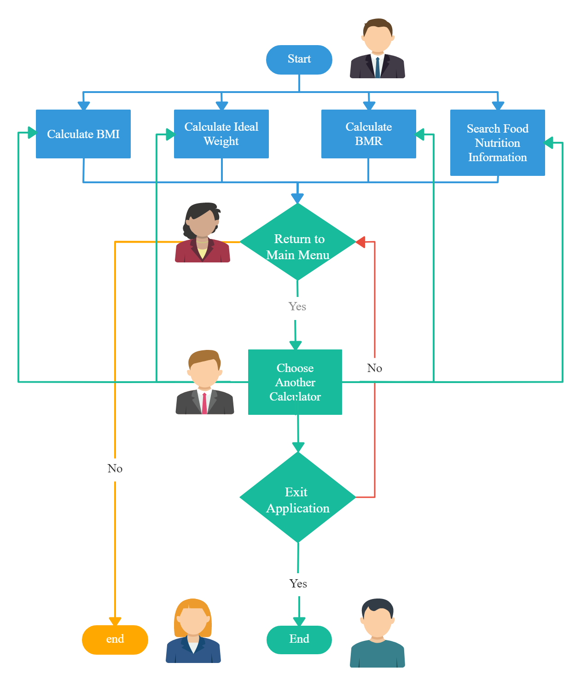

# Fitness-Calculator #

The Fitness Tool and Calculator desktop application is a program that is helpful for those trying to reach their fitness goals. The app includes calculators for BMI, BMR, and Ideal Weight. It also features a Food Nutrition Information section that allows the user to search for certain foods and receive nutrition and macronutrient information.

### Group Members ###
Leorenzo Openano,
Allyson Shen

### Setup ###

The App runs on Python version 3

The app uses external software packages and must be installed using:  
$sudo apt-get install python3-tk  
$sudo apt-get install python3-requests  

### Command Line Inputs ###
To run this application on Ubuntu 20.04, clone this repository and then enter the correct directory containing the project. Run the file with the following commands:   
1. $ cd cpsc-254-project  
2. $ python fitness-calculator.py  

### Use Case Diagram ###

